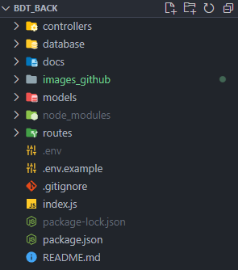
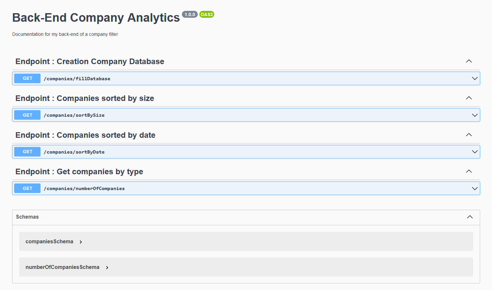
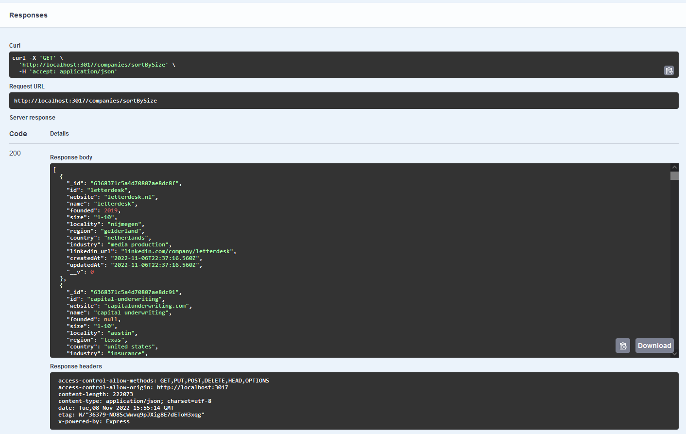
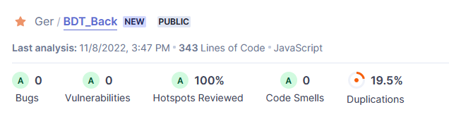
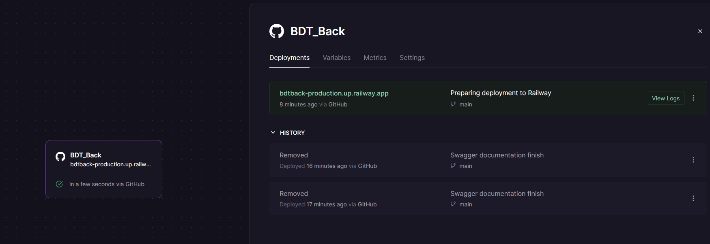

# Back-end Hackathon para Jump2Digital evento organizado por Barcelona Digital Talent

_Emularemos el comportamiento de un panel de Networking para poder filtrar una lista de empresas de forma simple y conseguir que la conexión entre empresas y usuarios sea más fluida utilizando MongoDB, Mongoose y NodeJS_

## Tecnologias utilizadas 🚀

El proyecto ha sido desarrollado utilizando los siguientes paquetes en Nodejs:

* Nodemon
* Expresss
* Mongoose
* Dotenv
* Axios
* Swagger-ui-express

## ¿Como desplegar el proyecto en local? 📋

Estas instrucciones te permitirán obtener una copia del proyecto en funcionamiento en tu máquina local para propósitos de desarrollo:

Clonarte el repositorio localmente:
> git clone [url del repositorio]

Instalar las depedencias necesarias:
> npm i

Rellenar las variables necesarias en el archivo .env.example para iniciar el proyecto, despues cambiarle el nombre a .env:
> >   -  Puerto en el que quieras que se ejecute el server, PORT
> >   -  Cadena de conexión con la base de datos en Mongo Atlas, MONGO_URI

Arrancar el proyecto:
> npm start

## Esquema del servidor en Nodejs y endpoints 🛠️

El sistema ataca al modelo "Company" del que disponemos en la base de datos, y puede realizar estas acciones (endpoints):
- fillDatabase: Crea nuestra base de datos en MongoDB con los datos proporcionados en https://challenges-asset-files.s3.us-east-2.amazonaws.com/jobMadrid/companies.json y guarda la lista de compañias
- sortBySize: Devuelve las compañías ordenadas por tamaño
- sortByDate: Devuelve las compañías ordenadas por fecha de creación 
- numberOfCompanies: Devuelve los siguientes datos: Número de empresas que hay en cada industria, Número de empresas que hay por cada rango de tamaños, Número de empresas que hay en cada año de creación

La estructura de nuestro proyecto contiene las siguientes carpetas:

## Documentación con Swagger 📚

Mediante el paquete de Swagger hemos podido documentar cada uno de los endpoints del proyecto:

Además también se pueden ejecutar y obtener la respuesta de cada uno:

## Calidad del código: SonarCloud ✅

Se ha utlizado SonarCloud para medir la calidad del código:

## Despliegue en Railway 🏗️

El proyecto se encuentra desplegado en Railway, se pueden ejecutar sus endpoints y ver su documentación en el siguiente enlace:

https://bdtback-production.up.railway.app/

## Organización a la hora de trabajar en este proyecto 📌

El proyecto consta de dos ramas: main y develop, las distintas funcionalidades del proyecto se han implementado en distintas ramas que posteriormente se han fusionado con la rama develop que es la encargada de actualizar todo el trabajo de desarrollo. Finalmente con una versión estable de la rama develop la fusionamos con la rama main, la encargada de mostrar nuestro Back-End en producción.

---

😀 Hecho por [Germán Fernández](https://www.linkedin.com/in/geerdev/) 🧑‍💻
